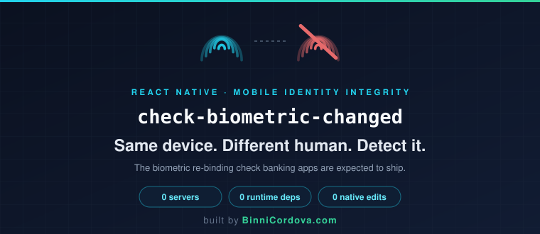
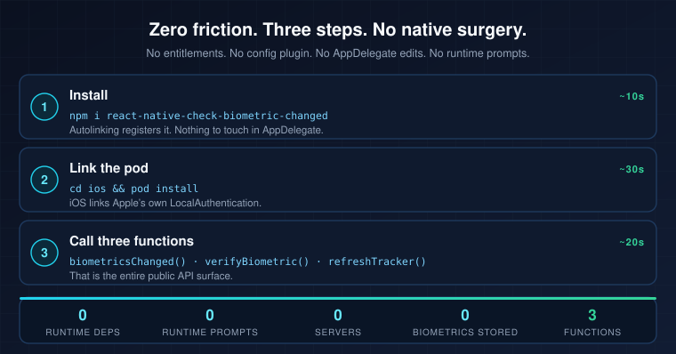
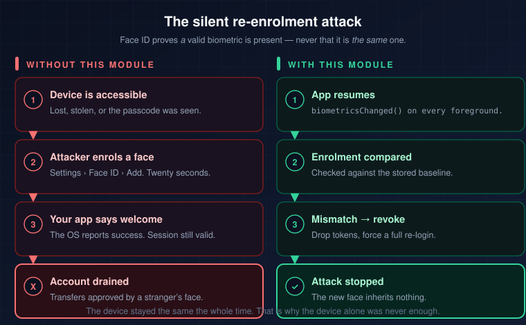
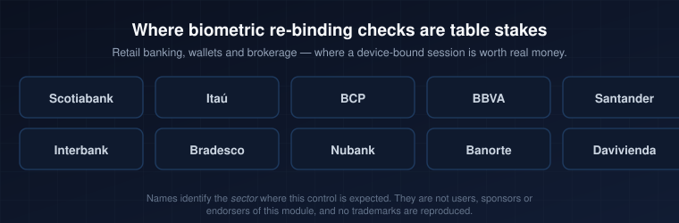

<p align="center">
  
</p>

<p align="center">
  <strong>by <a href="https://binnicordova.com">BinniCordova.com</a></strong>
</p>

<p align="center">
  <a href="https://www.npmjs.com/package/react-native-check-biometric-changed"></a>
  
  
  <a href="./LICENSE"></a>
</p>

> ### Same device. Different human. Detect it.
>
> Is the biometric protecting this session still the same one enrolled when the session was granted? When the answer is no, revoke the session before the new face inherits it.

## Install — zero friction



```sh
npm install react-native-check-biometric-changed
cd ios && pod install
```

Autolinking does the rest. No `AppDelegate` edits, no config plugin, no runtime permission prompts, no third-party SDK.

**iOS** links only Apple's `LocalAuthentication`. The one `Info.plist` key it needs, `NSFaceIDUsageDescription`, you already ship if you use Face ID.

**Android** needs `minSdkVersion 23` and pulls in `androidx.biometric`, which merges the normal — install-time, non-prompting — `USE_BIOMETRIC` permission.

## Usage

```js
import {
  biometricsChanged,
  refreshTracker,
  verifyBiometric,
} from 'react-native-check-biometric-changed';

// Run on cold start AND on every foreground — a re-enrolment can happen
// while your app is backgrounded.
if (await biometricsChanged()) {
  // ALERT! The enrolment behind this session is not the one you trusted.
  // Revoke first: drop tokens, clear the keychain, force a full login.
  await logoutHard();

  // Re-trust needs a factor the attacker does NOT have. Verify the credential
  // against your server before the biometric — see the warning below.
  const session = await loginWithCredentials();

  if (session && (await verifyBiometric())) {
    await refreshTracker(); // only now is this enrolment the trusted baseline
  }
}
```

> **`verifyBiometric()` cannot close this gap on its own.** It proves *a currently
> enrolled* biometric was presented — and once an attacker has enrolled their own
> face, theirs is enrolled. Calling `refreshTracker()` on the strength of it hands
> them the baseline and undoes the detection. Re-trust only behind a login your
> server verified.

| Function | Returns | Does |
| --- | --- | --- |
| `biometricsChanged()` | `Promise<boolean>` | `true` when the enrolment differs from the baseline |
| `verifyBiometric()` | `Promise<boolean>` | Presents the system biometric prompt. `false` means cancelled or failed — never "not the owner" |
| `refreshTracker()` | `Promise<boolean>` | Stores the current enrolment as trusted. Never call it unconditionally |

Runnable demo in [`/example`](https://github.com/binnicordova/react-native-check-biometric-changed/tree/main/example).

## Why it matters



Face ID proves *a* valid biometric is present — never that it is *the same* one you trusted at enrolment. Anyone who unlocks the device once can add their own face in Settings in under a minute, and every prompt after that succeeds. For them. Detecting that re-binding is the app's job.



## How it works

**iOS** stores Apple's opaque `evaluatedPolicyDomainState` blob in the **Keychain** (`WhenUnlockedThisDeviceOnly`, so it never syncs to iCloud) and compares it on demand.

**Android** mints an AndroidKeyStore key with `setInvalidatedByBiometricEnrollment(true)`. The OS permanently invalidates that key the moment a biometric is enrolled or removed, so initialising a `Cipher` with it is a tamper-proof probe: `KeyPermanentlyInvalidatedException` means the enrolment changed.

Neither platform reads, derives, transmits or stores biometric data. There is no server and no network call.

## Biometric support

| Modality | iOS | Android |
| --- | --- | --- |
| Fingerprint / Touch ID | ✅ | ✅ Class 3 essentially always |
| Face ID / face unlock | ✅ | ⚠️ only if the OEM ships it as Class 3 |
| Iris | — | ✅ if Class 3 |
| Passcode / PIN / pattern | ❌ by design | ❌ by design |

Android can only track **Class 3 (strong)** biometrics, because Keystore keys can
only be gated by Class 3. A Class 2 face enrolment — what most OEM face unlock
actually is — cannot be detected, and no Android API reports weak-biometric
enrolment changes. Fingerprint is Class 3 nearly everywhere, so it is always
covered. Dropping to `BIOMETRIC_WEAK` would not help: it breaks the Keystore
mechanism outright and you would lose fingerprint detection too.

## Status

- **Detection is not attribution.** The OS reports *that* the enrolment set changed, never *who* changed it or to what. Treat any change as untrusted and re-authenticate.
- **A lockout is not a change.** Too many failed attempts rejects with `BIOMETRICS_LOCKED_OUT` rather than resolving `true`, so a wrong thumb never tears down a session.
- **This is one control, not a security architecture.** Pair it with server-side session revocation, jailbreak/root detection and certificate pinning.

Verified on a Samsung SM-A266M (Android 16): the Keystore baseline is minted and
probed correctly on device, and that handset reports face as Class 2 and
fingerprint as Class 3 — the split described above, in the wild. On an iOS 26.5
simulator, `evaluatedPolicyDomainState` returns a real 32-byte enrolment state
and the module rejects rather than guessing when its baseline is unreadable.

## Author

Built and maintained by **[BinniCordova.com](https://binnicordova.com)** — Binni Zenobio Cordova Leandro.
Saved you an incident? [Buy me a coffee](https://www.buymeacoffee.com/binnicordova) ☕️

MIT — see [LICENSE](./LICENSE). See [CONTRIBUTING.md](CONTRIBUTING.md) to contribute.

<sub>Institution names identify the *sector* where this control is expected. They are not users, sponsors or endorsers of this module.</sub>
